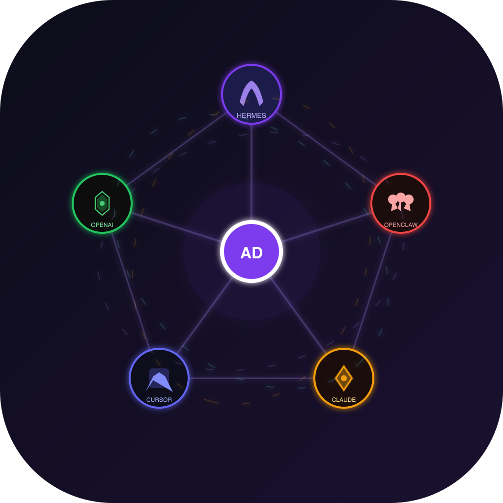
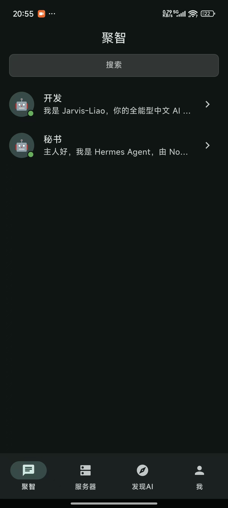
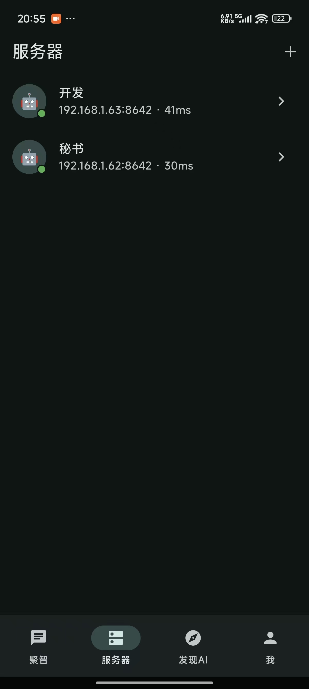
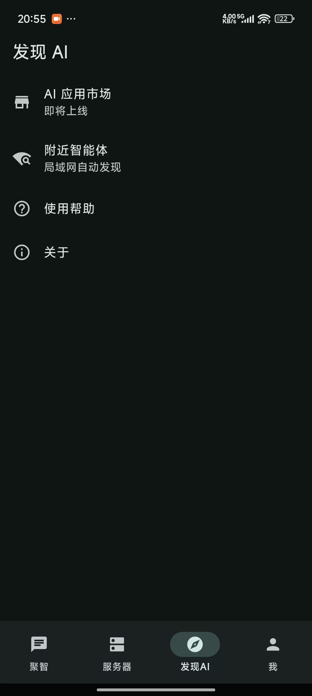
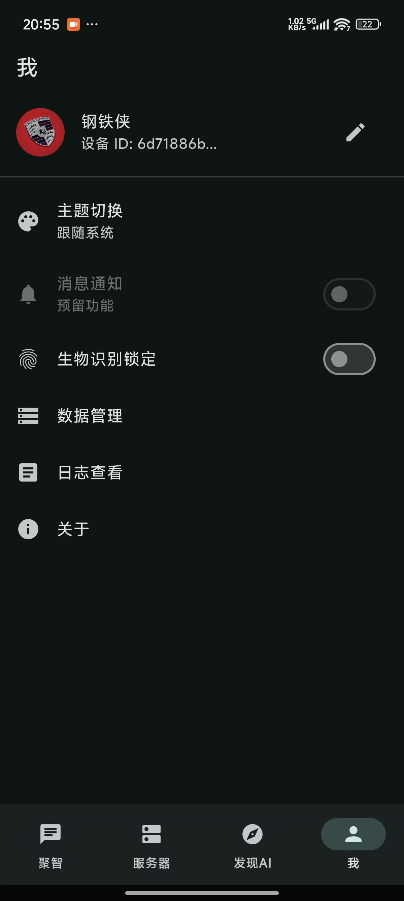
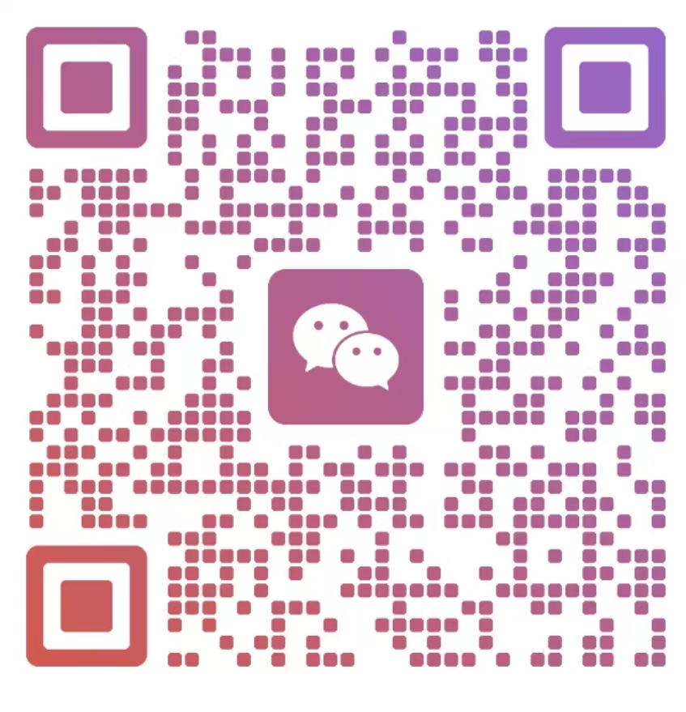

# Agent Dance &middot; [](https://flutter.dev) [](https://dart.dev) [](./LICENSE) [](https://github.com/liaosiliangCodeLife/agent_dance/releases)

**去中心化、隐私优先的智能体交互网络——装进口袋。**

Agent Dance 是一款 Flutter 移动端应用（Android + iOS），为你提供一个私有的、安全的智能体入口。不依赖任何 IM 平台，不经第三方服务器。只有你和你的智能体，端到端直连。
现在，你可以动动手指就能控制你的智能体干活啦！

<p align="center">
  
</p>

---

## 为什么做 Agent Dance？

今天，远程操控 AI 智能体（Hermes、Claude Code、OpenClaw 等）几乎都走 IM 通道——微信、Telegram、Discord。这带来三个致命问题：

| 问题 | 影响 |
|------|------|
| **中心化依赖** | 消息路由和存储全在平台手里，随时可被切断 |
| **隐私风险** | 对话数据经过第三方服务器，敏感信息存在泄露风险 |
| **受制于人** | API 限制、封禁风险、审查机制不可控 |

**Agent Dance 砍掉了中间商。** 通过你自己的隧道直连智能体。数据存本地，密钥存钥匙串。

---

## 核心功能

### 四 Tab 一站式管理

| Tab | 用途 |
|-----|------|
| 🧠 **智能体** | 对话交互——流式 Markdown 渲染、思考过程展示、图片/语音输入 |
| 🖥️ **服务器** | 节点管理——添加、测试、延迟监控、健康检测 |
| 🔍 **发现AI** | 局域网发现、应用市场、帮助与关于 |
| 👤 **我** | 个人资料、主题切换、生物识别锁定、数据管理 |

### 对话体验

- **流式输出**：打字机效果 + 闪烁光标
- **Markdown 渲染**：代码块语法高亮、表格、列表、公式
- **思考过程**：DeepSeek 等推理模型思考链实时展示，可折叠，视觉区分
- **图片输入**：拍照 / 相册选择，自动压缩（≤2048px，≤2MB），气泡内缩略图预览
- **语音输入**：长按录音，波形动画 + 计时，服务端 faster-whisper 转录
- **工具进度**：智能体执行工具时实时显示进度条和状态
- **指令审批**：危险操作确认弹窗，60 秒无操作自动批准

### 单轮对话模式

每次发送消息是全新对话，不携带历史上下文。交互轻量、无状态、隐私友好。对话页仅展示当前回合内容。

### 截图

▶️ **[观看演示视频](docs/8c65a076943dacf8cd3367a186ccc8e3.mp4)**

<p align="center">
  
  &nbsp;
  
  <br>
  
  &nbsp;
  
</p>

---

### 快速入门
1.选择
## 架构

```
┌──────────────────┐       OpenAI 兼容 HTTP API       ┌──────────────────┐
│   Agent Dance     │ ◀═════════════════════════════▶ │   Hermes Agent │
│  (Flutter App)    │      HTTP + SSE 流式            │  (API Server)    │
└──────────────────┘                                  └──────────────────┘
        │                                                     │
        │  局域网直连 / 隧道穿透 (NPS/frp)                      │
        ▼                                                     ▼
┌──────────────────┐                                  ┌──────────────────┐
│   本地 SQLite     │                                  │   大模型后端      │
│  (drift + 加密)   │                                  │ (DeepSeek 等)    │
└──────────────────┘                                  └──────────────────┘
```

**App 内部分层**：`UI → ViewModel → Repository → Protocol/DB`

---

## 技术栈

| 层 | 选型 |
|----|------|
| 框架 | **Flutter** (Dart 3.5+) |
| 架构 | MVVM + `ChangeNotifier` |
| 网络 | `http` + 手动 SSE 解析 |
| 本地数据库 | SQLite via **drift** |
| 安全存储 | `flutter_secure_storage` (Keychain / EncryptedSharedPreferences) |
| Markdown | `flutter_markdown` |
| 语音 | `record` (M4A/AAC 16kHz 单声道) |
| 图片 | `image_picker` + `flutter_image_compress` |
| UI | Material 3 |

---

## 快速开始

### 前置条件

- Flutter SDK ≥ 3.5（[安装指南](https://docs.flutter.dev/get-started/install)）
- Android SDK / Xcode（iOS 需 macOS）
- 运行中的 [Hermes Agent](https://hermes-agent.nousresearch.com) API Server（或其他 OpenAI 兼容端点）

### 构建与运行

```bash
# 克隆仓库
git clone <repo-url> && cd agent_dance

# 安装依赖
flutter pub get

# 生成代码（drift + freezed）
dart run build_runner build

# 连接设备运行
flutter run

# 构建 Android APK（仅 arm64）
flutter build apk --target-platform android-arm64
```

> **国内用户**：pub.dev 不稳定可设置镜像：
> ```powershell
> $env:PUB_HOSTED_URL="https://pub.flutter-io.cn"
> $env:FLUTTER_STORAGE_BASE_URL="https://storage.flutter-io.cn"
> ```

### 连接你的智能体

1. 打开 App → **服务器** Tab → 点 **+**
2. 填写名称、地址（如 `192.168.1.100`）、端口（默认 `8642`）、API Key
3. 点 **测试连接** 验证
4. 回到 **智能体** Tab → 点对应服务器开始对话

---

## 项目结构

```
agent_dance/
├── lib/
│   ├── main.dart                    # 入口
│   ├── app.dart                     # MaterialApp + 路由 + 主题
│   ├── config/                      # 应用配置
│   ├── agents/                      # 业务逻辑层 (MVVM)
│   │   ├── models/                  # Message、Session、ChatState、SseEvent
│   │   ├── database/                # SQLite (drift) — 会话 + 含推理的消息
│   │   ├── repositories/            # 数据仓库 — 聊天 + 会话 CRUD
│   │   └── viewmodels/              # 状态管理 (ChangeNotifier)
│   ├── protocol/                    # HTTP + SSE 客户端
│   ├── ui/                          # 界面层
│   │   ├── chatui/                  # 聊天页面 + 消息气泡 + 输入栏
│   │   ├── sessionui/               # 会话列表
│   │   └── settingui/               # 设置页
│   └── utils/                       # Logger、录音服务、图片服务
├── protocol/
│   └── api-contract.md              # API 接口协议（OpenAI 兼容）
├── assets/
│   └── icon.png                     # 应用图标
├── production_describe.md           # 产品愿景 & 路线图
└── pubspec.yaml
```

---

## 文档索引

| 文档 | 用途 |
|------|------|
| [production_describe.md](./production_describe.md) | 产品愿景、用户画像、P2P 架构设想 |
| [protocol/api-contract.md](./protocol/api-contract.md) | App 与 Hermes Agent 之间的 HTTP API 协议 |

---

## 路线图

| 阶段 | 重点 |
|------|------|
| **Phase 1** ✅ | 基础对话——文字、流式、Markdown、推理过程 |
| **Phase 2** 🚧 | 多媒体——图片输入、语音录制 + STT 转录 |
| **Phase 3** | 会话管理——多会话、历史持久化、全文搜索 |
| **Phase 4** | 安全增强——P2P 加密、生物识别、审批流程、访问控制 |
| **Phase 5** | 体验打磨——局域网发现、推送通知、多智能体并行对话 |

---

## 开源协议

MIT © 2026

**联系邮箱：**[liaosiliang1234@126.com](mailto:liaosiliang1234@126.com)  
**微信**（欢迎技术交流）：

<p align="left">
  
</p>

---

> [English](./README.md)
